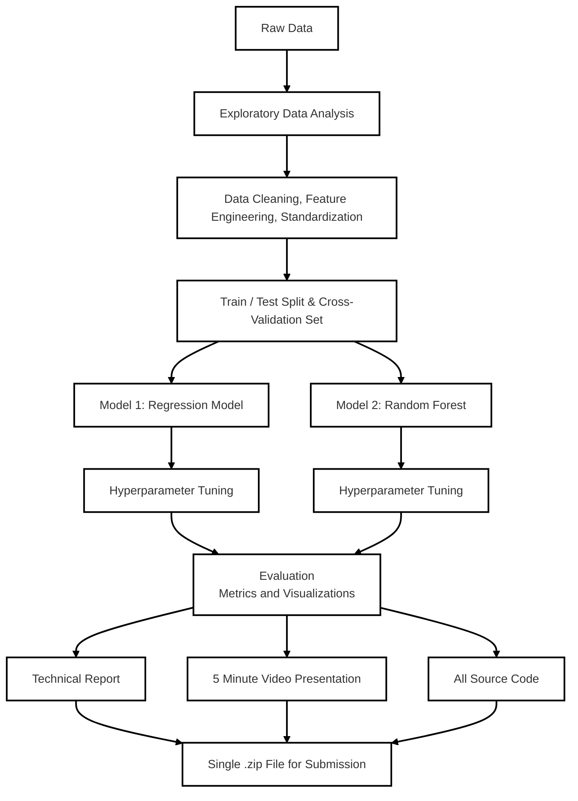

# **Pokémon  Card Price Predictor**

---

## Project Overview

* **Author:** Clay Morgan (Morgan.1461)
* **Course:** GRADTDA 5620 (SU26)
* **Dataset:** https://www.kaggle.com/datasets/kanchana1990/e-commerce-pokmon-card-pricing-data

---

## Project Goals

The goal of this project is to develop a predictive model that can estimate the market price of a Pokémon card based on its individual attributes. his is something that could benefit both sellers
and collectors to identify undervalued or overvalued cards. Also finding trends in card valuation,
such as a specific character commanding a premium while others sell consistently lower. 

*This project will result in a conclusion of whether it is possible to reliabily predict the price of a Pokémon card given only its encoded attributes.*

### Models and Techniques

This project will implement an end to end data workflow, beginning with the raw data. An exploratory data analysis will be conducted to determine important variables. Data cleaning techniques and feature engineering will be used to create new variables that could be useful for the later steps. 

Since this dataset has labeled outcomes and a clear response variable of price, supervised learning methods will be implemented. A regression model will be used as a baseline to predict the prices, and a random forest model will be used. 

---

## Dataset

This dataset has been sourced from Kaggle and contains the following variables of interest:

---

## Data Flow Diagram

## Progress

- [x] `Stage 1 (Final Project Proposal)` project_proposal.docx
- [x] `Exploratory Data Analysis` eda.ipynb
- [x] `Supervised Learning Method 1: Regression` model.ipynb
- [x] `Supervised Learning Method 2: Random Forest` model.ipynb
- [x] `Evaluation Metrics and Visualizations` model.ipynb
- [x] `Technical Report` (Maximum 15 pages, including text, visualizations, code, references) technical_report.docx
- [x] `3-5 Minute Video Presentation` .mp4 file included in final.zip
- [x] `Submit Final .zip`
